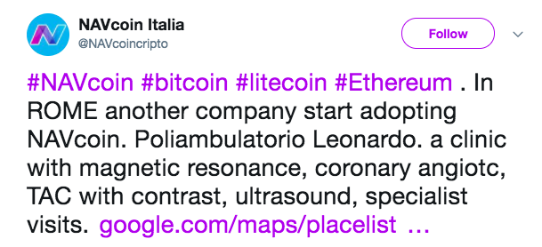
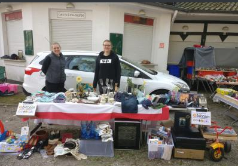
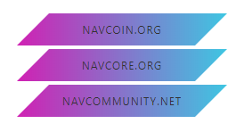

The great thing about decentralized community projects like this is that freedom of the individual is paramount. No one can tell you what NavCoin is or isn't, it is what you make it. This week there have been so many great contributions from all around the world where people are starting to put this empowering idea into practice.
<!--more-->
### What's happening in the community

NavCoin Italia reports on Reddit that a specialist medical clinic in Rome has begun accepting NavCoin. NavCoin Italia has been very active lately - so make sure to follow them and keep up with all they’re doing.

 
<section style="text-align: center">

  
</section>

Meanwhile at the other end of the retail spectrum check out NavCoin being accepted by these enterprising crypto enthusiasts at a flea market in Germany. Using NavPay they’ll see their payment come through almost instantly. Have you seen anything similar in your town? 

 
<section style="text-align: center">

  
</section>

Jonathan (on Discord) has been experimenting with button designs using the NavCoin colour palate and different angles at the sides. It was great to see so much positive feedback from other members of the community. Here is just one of Jonathon’s options.

 
<section style="text-align: center">

  
</section>

Beekart (on Discord) has been giving his design and illustration skills a good workout, creating banners featuring original hand drawn characters. What’s more in the spirit of our open-source decentralised community Beekart has made his work freely available to the community. Check it out on the NavCoin page on Reddit.

 
<section style="text-align: center">

  
</section>

### Meet up in the Netherlands
The details for the upcoming meetup on 12 May have changed. Here is the latest:
The new location is The Florin in Utrecht starting at 7 p.m. You can view the location at [www.florinutrecht.nl](https://www.florinutrecht.nl). Hopefully there will be plenty of photos to share with you after the event.

### Technical Updates
The updated NavPay release is getting closer. There have been some interesting challenges around handling multi-server clusters, but the developers working on it say to look out for an announcement soon, once testing and bug-fixing is complete.

Work on the update to the paper wallet is progressing well, with the Windows version next on the list. The devnet is almost ready too and it will be used to test upcoming pull requests for NavCoin Core. An alternative block explorer is being built which can used for the devnet and testnet.
hash512 (on Discord) reports that he’s building a NavTV box as a more powerful alternative to the NavPi. Get hold of him on Discord if you’d like to help out with this project by collaborating on communications, website development or wallet integration.

Prodpeak (on Discord) is also working on a block explorer. If you’d like to give him a hand, reach out on Discord. There are plenty of technical challenges for smart devs to overcome, and as they say ‘many hands make light&nbsp;work.’

### Content and Media
One of the key focuses for the NavCoin Core team over next few months is in creating a framework that makes it easy for the wider NavCoin community to contribute. Whether that’s creating content, organising meetups, or developing tools - it should be clear how anyone can get involved and the steps involved. It won’t be the NavCoin core team telling everyone what they should be working on, but rather a much more organic approach where individuals decide what they want to work on. It’s less about having a large single team that everyone joins, and more about having lots of smaller independent teams that people can easily move between.

The first part of this framework is the NavCoin brand guidelines (known as the bible) and the Developer and Content Creator manifesto’s.

 
<section style="text-align: center">

  
</section>

The brand bible sets out the Core Media and Content Creators suggestions on typefaces and how to use them, it displays the brand’s colour palate, and gives useful tips on how to create visuals and write with the NavCoin tone of voice. It’s hoped that having a brand bible will make it easier for you to get started on creating your own content for NavCoin. It’s almost finished, and will be available to download soon from the NavCoin Community&nbsp;Hub.

The content collective have also been refining the ‘Core Developer’, and ‘Core Media and Content Creator’ manifestos. These documents detail the beliefs NavCoin core agree to uphold as members of the NavCoin community. Once they’re completed they will also be available on the community site. Look out for them soon.

The NavCoin Core team are also looking to rename the NavCore community hub website to make it more clear what the purpose of the website is. NavCoin.org is aiming to be information related to the protocol - how it works, the technical information, and documentation. The community hub (NavCore.org) on the other hand is more focused on community efforts - such as which projects are being worked on, and how to get involved. So please submit your ideas for domain names to our Discord or Reddit channels - the only requirement is that the domains are available for use.

They’ve also been preparing content for the release of version 4.1 of NavPay - to help let people know what’s changed, and where to go to download it.

That’s all for this week,

NavCoin Core
